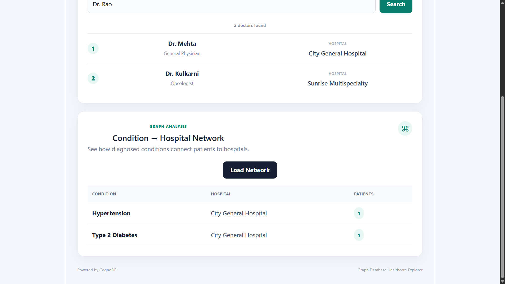
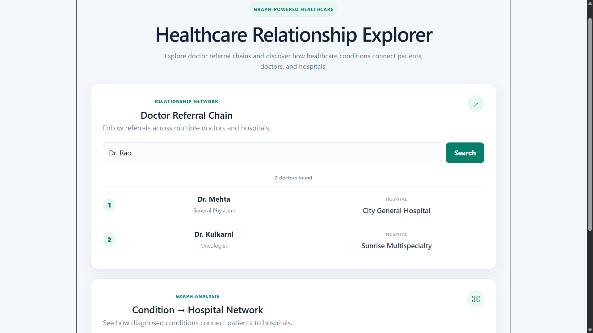

# Healthcare Relationship Explorer

A graph-based healthcare explorer built with Spring Boot, React, and CognoDB. The application allows users to explore doctor referral chains and condition-to-hospital relationships.


## Why a Graph Database?

Healthcare data contains many connected entities such as doctors, hospitals, patients, conditions, and treatments. These connections are important for understanding referral pathways and healthcare networks.

A graph database is a good fit because relationships are first-class data. For example, the application can follow a multi-hop referral chain such as:

Doctor → REFERRED_TO → Doctor → REFERRED_TO → Doctor

This makes relationship-based questions easier to express than repeatedly joining multiple relational tables.

The application also uses graph traversal to find hospitals associated with patients and their diagnosed conditions.


## Data Model

```text
                         ┌─────────────────────┐
                         │       Hospital      │
                         │    name, city       │
                         └──────────▲──────────┘
                                    │
                                  WORKS_AT
                                    │
                         ┌──────────┴──────────┐
                         │       Doctor        │
                         │ name, specialty     │
                         └──────────┬──────────┘
                                    │
                               REFERRED_TO
                                    │
                                    ▼
                         ┌─────────────────────┐
                         │       Doctor        │
                         │ name, specialty     │
                         └─────────────────────┘


┌─────────────────────┐
│       Patient       │
│ name, age, gender   │
└──────────┬──────────┘
           │
     ┌─────┴───────────────┐
     │                     │
 TREATED_BY          DIAGNOSED_WITH
     │                     │
     ▼                     ▼
┌───────────────┐    ┌──────────────────┐
│    Doctor     │    │    Condition     │
│name, specialty│    │ name, category   │
└───────────────┘    └──────────────────┘

```

## Setup and Run

### 1. Create a CognoDB Instance

Create a free CognoDB instance and obtain the Bolt connection URI and password.

### 2. Configure Environment Variables

Create a `.env` file in the `backend` directory:

```text
COGNODB_URI=your_cognodb_uri
COGNODB_USERNAME=cognodb
COGNODB_PASSWORD=your_password


## Main Cypher Queries

### 1. Multi-Hop Doctor Referral Traversal

This query follows referral relationships from a starting doctor for up to four hops.

```cypher
MATCH (start:Doctor {name: $name})-[:REFERRED_TO*1..4]->(reached:Doctor)
MATCH (reached)-[:WORKS_AT]->(h:Hospital)
RETURN DISTINCT
       reached.name AS doctor,
       reached.specialty AS specialty,
       h.name AS hospital
```

The `$name` parameter is supplied through the official Neo4j Java driver.

The seeded data contains this two-hop referral chain:

```text
Dr. Rao
   │
   │ REFERRED_TO
   ▼
Dr. Mehta
   │
   │ REFERRED_TO
   ▼
Dr. Kulkarni
```

### 2. Condition → Hospital Network

This query finds hospitals associated with patients diagnosed with each condition and counts the patients.

```cypher
MATCH (p:Patient)-[:DIAGNOSED_WITH]->(c:Condition)
MATCH (p)-[:TREATED_BY]->(d:Doctor)-[:WORKS_AT]->(h:Hospital)
RETURN
       c.name AS condition,
       h.name AS hospital,
       count(DISTINCT p) AS patientCount
ORDER BY condition
```

This query traverses:

Patient → Condition

and:

Patient → Doctor → Hospital

A relational database would require several joins to represent these relationships.


## UI Screenshots

### Condition → Hospital Network



### Doctor Referral Chain


